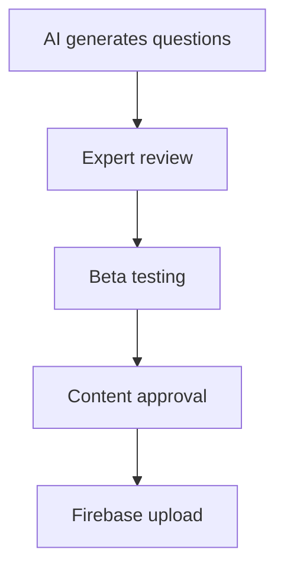

# Automated Quarterly Question Pack Release System

## Overview
This document outlines a robust, scalable, and automated system for releasing new question pack versions every quarter (March, June, September, December) to maximize revenue generation.

## 🎯 Business Goals
- Generate continuous revenue through version releases
- Maintain customer engagement with fresh content
- Build anticipation for quarterly updates
- Create opportunities for upselling and cross-selling
- Establish recurring revenue streams

## 🏗️ System Architecture

### 1. Content Generation Pipeline

#### AI-Powered Question Generation
```typescript
// Future AI Service Integration
class AIQuestionGeneratorService {
  async generateQuestions(theme: string, difficulty: string, count: number): Promise<Question[]> {
    // Integration with OpenAI GPT-4, Claude, or custom models
    // Prompt engineering for historical accuracy
    // Fact-checking and validation
  }
  
  async validateHistoricalAccuracy(questions: Question[]): Promise<ValidationResult> {
    // Cross-reference with historical databases
    // Expert review suggestions
    // Accuracy scoring
  }
}
```

#### Quality Control Workflow
1. **AI Generation** → Generate initial question sets
2. **Expert Review** → Historical accuracy validation
3. **Community Testing** → Beta testing with select users
4. **Final Approval** → Quality assurance sign-off

### 2. Firebase Integration for Scalability

#### Database Structure
```javascript
// Firebase Firestore Collections
collections = {
  questionPacks: {
    [packId]: {
      baseId: "region_pack_rome",
      version: "v2",
      releaseDate: "2025-09-01",
      questions: [...],
      sampleQuestions: [...],
      isCurrentVersion: true,
      status: "published" | "draft" | "archived"
    }
  },
  
  versionHistory: {
    [packId]: {
      versions: [
        { version: "v1", releaseDate: "2025-06-01", status: "legacy" },
        { version: "v2", releaseDate: "2025-09-01", status: "current" }
      ]
    }
  },
  
  releaseSchedule: {
    quarters: {
      "2025-Q3": {
        releaseDate: "2025-09-01",
        packs: ["region_pack_rome_v2", "region_pack_egypt_v2"],
        status: "planned" | "in_progress" | "released"
      }
    }
  }
}
```

#### Firebase Functions for Automation
```javascript
// Automated release function
exports.quarterlyRelease = functions.pubsub
  .schedule('0 0 1 3,6,9,12 *') // First day of quarters
  .onRun(async (context) => {
    // Publish new versions
    // Archive old versions to legacy
    // Send notifications to users
    // Update pricing tiers
  });
```

### 3. Revenue Optimization Strategy

#### Pricing Tiers for Versions
- **Current Version**: Full price ($1.99)
- **Previous Version**: Discounted price ($0.99)
- **Legacy Versions (2+ versions old)**: Bundle deals ($4.99 for 3 packs)

#### Subscription Model Enhancement
```typescript
interface VersionAccessTier {
  tier: 'free' | 'basic' | 'premium' | 'ultimate';
  currentVersionAccess: boolean;
  previousVersionAccess: boolean;
  legacyVersionAccess: boolean;
  earlyAccess: boolean; // Access 1 week before public release
}
```

## 🤖 Automated Release Workflow

### Phase 1: Content Preparation (Month 1)


### Phase 2: Pre-Release (Month 2)
- **Week 1-2**: Marketing campaign preparation
- **Week 3**: Premium subscribers early access
- **Week 4**: Final testing and bug fixes

### Phase 3: Release (Month 3)
- **Day 1**: Public release
- **Week 1**: Monitor user engagement
- **Week 2-4**: Performance optimization

## 📱 Implementation Components

### 1. Enhanced Store Screen Features
✅ **Already Implemented:**
- Version display banner
- Tab system (Current/Subscription/Legacy)
- Sample quiz button (10 questions: 3 easy, 4 medium, 3 hard)
- Visual version indicators

### 2. Version Management Service
✅ **Already Implemented:**
- Current vs legacy bundle management
- Version comparison utilities
- Quarterly release date calculation

### 3. Sample Quiz Service  
✅ **Already Implemented:**
- Balanced difficulty distribution
- Theme-based question filtering
- Quiz generation and storage

## 🔄 Quarterly Release Process

### Automated Steps
1. **Content Generation**
   ```bash
   # Automated script (runs monthly)
   npm run generate-content --theme=rome --version=v2
   npm run validate-content --pack=region_pack_rome_v2
   npm run upload-to-firebase --pack=region_pack_rome_v2
   ```

2. **Version Management**
   ```bash
   # Pre-release automation
   npm run prepare-release --quarter=2025-Q4
   npm run schedule-notifications --date=2025-12-01
   npm run update-legacy-pricing --discount=50
   ```

3. **Release Deployment**
   ```bash
   # Release day automation
   npm run deploy-new-versions --quarter=2025-Q4
   npm run archive-old-versions --cutoff=2-versions
   npm run send-release-notifications
   ```

## 📊 Revenue Tracking & Analytics

### Key Metrics Dashboard
```typescript
interface RevenueMetrics {
  quarterlyRevenue: number;
  versionPurchaseBreakdown: {
    current: number;
    previous: number;
    legacy: number;
  };
  subscriptionConversions: number;
  sampleQuizToPurchase: number;
  userRetention: number;
}
```

### A/B Testing Framework
- Sample quiz length (10 vs 15 questions)
- Pricing strategies for legacy versions
- Notification timing for new releases
- UI/UX optimizations for conversion

## 🚀 Implementation Timeline

### Immediate (Next 2 Weeks)
✅ **Completed:**
- Store Screen with sample quiz buttons
- Version management system
- Legacy pack display
- Sample quiz generation

### Short Term (1-2 Months)
- [ ] Firebase integration for question storage
- [ ] AI question generation service
- [ ] Automated release scripts
- [ ] User notification system

### Medium Term (3-6 Months)
- [ ] Expert review workflow
- [ ] Community beta testing platform
- [ ] Advanced analytics dashboard
- [ ] Revenue optimization algorithms

### Long Term (6-12 Months)
- [ ] Machine learning for question difficulty
- [ ] Personalized content recommendations
- [ ] Multi-language support
- [ ] Partnership integrations

## 💰 Revenue Projections

### Conservative Estimates (per quarter)
- **New Version Sales**: 1,000 users × $1.99 = $1,990
- **Legacy Pack Sales**: 500 users × $0.99 = $495
- **Subscription Upgrades**: 200 users × $29.99 = $5,998
- **Total Quarterly Revenue**: ~$8,483

### Growth Projections
- **Year 1**: $33,932 (4 quarters)
- **Year 2**: $67,864 (with user base growth)
- **Year 3**: $135,728 (with premium features)

## 🔧 Technical Implementation

### Next Steps for Full Automation
1. **Set up Firebase project**
   ```bash
   npm install firebase firebase-admin firebase-functions
   firebase init firestore functions
   ```

2. **Create AI integration**
   ```bash
   npm install openai @anthropic-ai/sdk
   # Configure API keys and prompt templates
   ```

3. **Implement release automation**
   ```bash
   # Create GitHub Actions workflow
   # Set up cron jobs for quarterly releases
   # Configure notification services
   ```

## 📞 Support & Maintenance

### Monitoring & Alerts
- Revenue tracking dashboards
- User engagement metrics
- Technical performance monitoring
- Content quality assurance

### Scaling Considerations
- Database optimization for growing question sets
- CDN for fast content delivery
- Caching strategies for improved performance
- Load balancing for high traffic periods

---

## 🎉 Success Metrics

### Primary KPIs
- **Monthly Recurring Revenue (MRR)**
- **Customer Acquisition Cost (CAC)**
- **Lifetime Value (LTV)**
- **Quarterly Growth Rate**

### Secondary KPIs
- Sample quiz completion rate
- Version upgrade conversion rate
- User retention after version releases
- Support ticket volume

This system is designed to run with minimal manual intervention while maximizing revenue opportunities through strategic content releases and user engagement optimization.
